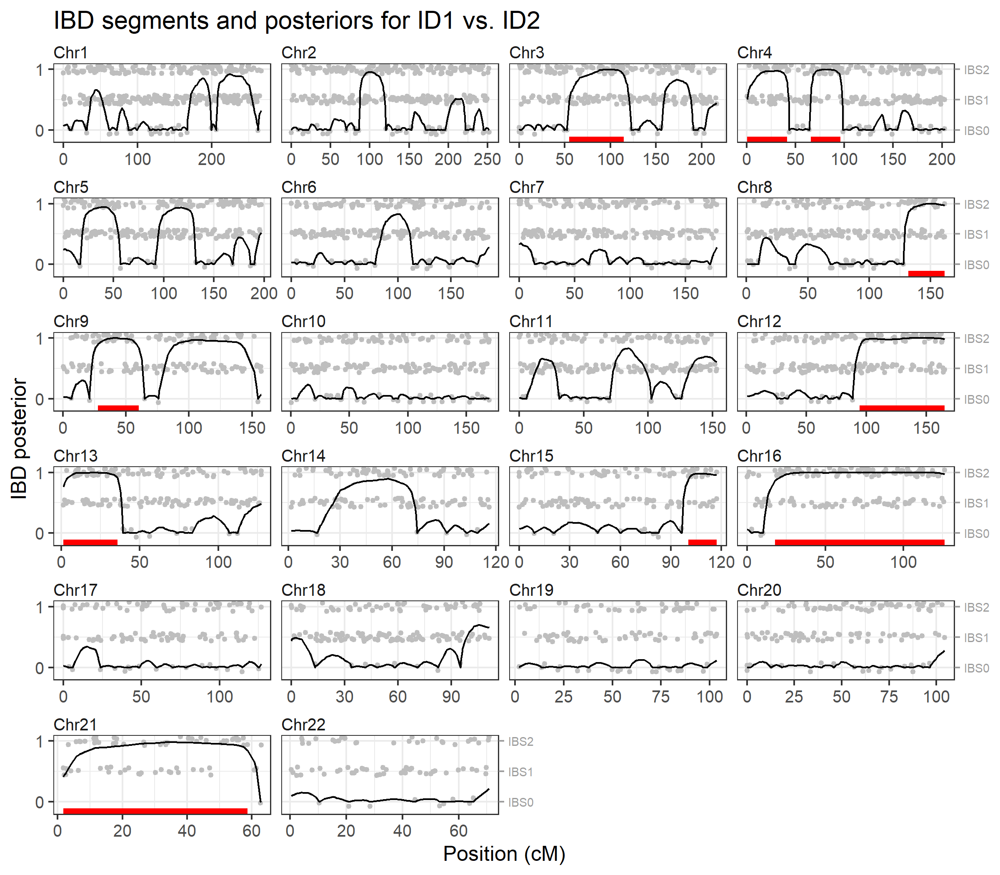
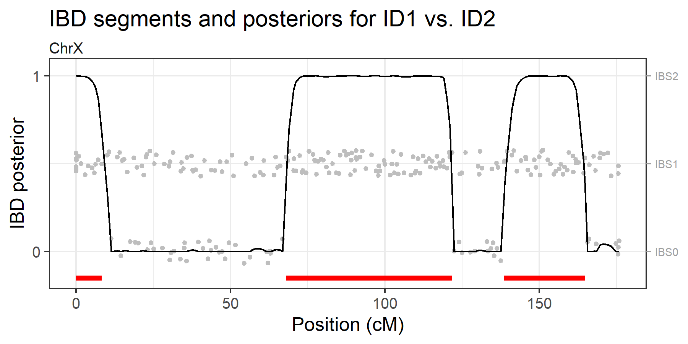

<!-- README.md is generated from README.Rmd. Please edit that file -->

# ibdfindr

<!-- badges: start -->

<!-- badges: end -->

The goal of **ibdfindr** is to detect genomic regions shared *identical
by descent* (IBD) between two individuals, using SNP genotypes. It does
so by fitting a continuous-time hidden Markov model (HMM) to the data.

## Installation

While **ibdfindr** is not on CRAN yet, you may install the development
version from GitHub:

``` r
remotes::install_github("magnusdv/ibdfindr")
```

## Example

``` r
library(ibdfindr)
```

As an example we consider the built-in dataset `cousinsDemo`, which
contains almost 4000 SNP genotypes for two related individuals (in fact,
a pair of cousins).

``` r
head(cousinsDemo)
#> # A tibble: 6 × 9
#>   CHROM MARKER        MB    CM A1    A2    FREQ1 ID1   ID2  
#>   <chr> <chr>      <dbl> <dbl> <chr> <chr> <dbl> <chr> <chr>
#> 1 1     rs9442372   1.08 0     G     A     0.611 A/G   A/G  
#> 2 1     rs4648727   1.84 0.328 C     A     0.637 A/A   A/C  
#> 3 1     rs10910082  2.49 1.24  T     C     0.626 T/T   C/T  
#> 4 1     rs6695131   3.08 2.00  C     T     0.572 C/T   C/C  
#> 5 1     rs3765703   3.68 4.81  T     G     0.594 T/T   T/T  
#> 6 1     rs7367066   3.89 5.86  C     T     0.674 C/C   C/C
```

The function `findIBD()` conveniently wraps the key steps of the
package:

- Fit a continuous-time HMM to the data (`fitHMM()`)
- Find the most likely set of IBD segments (`findSegments()`)
- Calculate the posterior IBD probability at each marker
  (`ibdPosteriors()`)

``` r
ibd = findIBD(cousinsDemo)
#> Chromosome type: autosomal 
#> Fitting HMM parameters...
#>   Optimising `k1` and `a` jointly
#>   k1 = 0.128, a = 5.070
#> Finding IBD segments...
#>   10 segments (total length: 481.10 cM)
#> Calculating IBD posteriors...
#> Analysis complete in 0.974 secs
```

For details of the different steps, see the documentation of the
individual functions: `fitHMM()`, `findSegments()`, and
`ibdPosteriors()`.

To visualise the results we pass the output to `plotIBD()`. This plots
the posterior probabilities on a background (gray points) showing the
identity-by-state (IBS) status at each marker, i.e. whether the
individuals have 0, 1 or 2 alleles in common. Inferred IBD regions are
shown as red segments at the bottom of each chromosome panel.

``` r
plotIBD(ibd)
```



## X-chromosome example

The `brothersX` dataset contains genotypes for two brothers typed with
246 X-chromosomal SNPs. The analysis below indicates that they share 3
IBD segments on the X chromosome.

``` r
ibdX = findIBD(brothersX)
#> Chromosome type: X (male/male) 
#> Fitting HMM parameters...
#>   Optimising `k1` and `a` jointly
#>   k1 = 0.652, a = 7.102
#> Finding IBD segments...
#>   3 segments (total length: 101.74 cM)
#> Calculating IBD posteriors...
#> Analysis complete in 0.0919 secs

plotIBD(ibdX)
```


