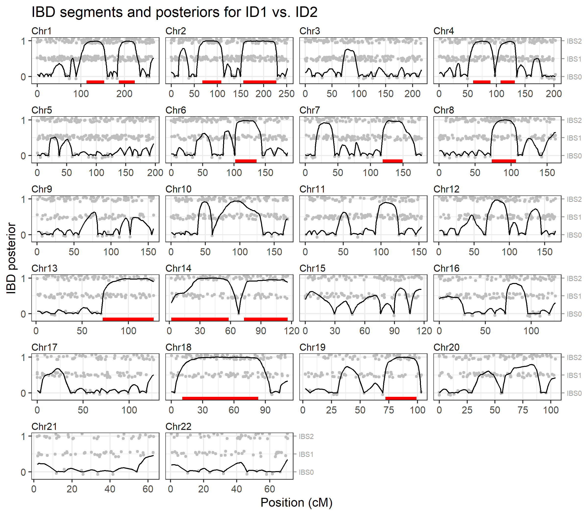

<!-- README.md is generated from README.Rmd. Please edit that file -->

# ibdfindr

<!-- badges: start -->

[](https://CRAN.R-project.org/package=ibdfindr)
<!-- [](https://cran.r-project.org/package=ibdfindr)
[](https://cran.r-project.org/package=ibdfindr)
 badges: end -->

The goal of **ibdfindr** is to detect genomic regions shared *identical
by descent* (IBD) between two individuals, using SNP genotypes. It does
so by fitting a continuous-time hidden Markov model (HMM) to the data.

## Installation

To get the latest official release of **ibdfindr**, install from CRAN as
follows:

``` r
install.packages("ibdfindr")
```

For the development version, install from GitHub:

``` r
remotes::install_github("magnusdv/ibdfindr")
```

## Example

``` r
library(ibdfindr)
```

As an example we consider the built-in dataset `cousinsDemo`, which
contains almost 4000 SNP genotypes for two related individuals. The data
were simulated assuming a relationship of first cousins. (For complete
details on how the data was generated, the source code is available in
the `data-raw` folder.)

``` r
head(cousinsDemo)
```

    #>   CHROM     MARKER       MB        CM A1 A2  FREQ1 ID1 ID2
    #> 1     1  rs9442372 1.083324 0.0000000  A  G 0.3890 A/G G/G
    #> 2     1  rs4648727 1.844830 0.1803812  A  C 0.3628 A/C A/C
    #> 3     1 rs10910082 2.487496 1.2670505  C  T 0.3740 C/T C/T
    #> 4     1  rs6695131 3.084360 1.9782286  C  T 0.5719 C/T C/T
    #> 5     1  rs3765703 3.675872 4.8403127  G  T 0.4058 G/G T/T
    #> 6     1  rs7367066 3.887191 5.7748481  C  T 0.6739 C/C C/C

The function `findIBD()` conveniently wraps the key steps of the
package:

- Fit a continuous-time HMM to the data (`fitHMM()`)
- Find the most likely set of IBD segments (`findSegments()`)
- Calculate the posterior IBD probability at each marker
  (`ibdPosteriors()`)

``` r
ibd = findIBD(cousinsDemo)
#> Individuals: ID1, ID2 
#> Chromosome type: autosomal 
#> Fitting HMM parameters...
#>   Optimising `k1` and `a` jointly; method: L-BFGS-B 
#>   k1 = 0.185, a = 7.430
#> Finding IBD segments...
#>   14 segments (total length: 597.21 cM)
#> Calculating IBD posteriors...
#> Analysis complete in 0.959 secs
```

For details of the different steps, see the documentation of the
individual functions: `fitHMM()`, `findSegments()`, and
`ibdPosteriors()`.

To visualise the results we pass the output to `plotIBD()`. This plots
the posterior probabilities on a background (grey points) showing the
identity-by-state (IBS) status at each marker, i.e. whether the
individuals have 0, 1 or 2 alleles in common. Inferred IBD regions are
shown as red segments at the bottom of each chromosome panel.

``` r
plotIBD(ibd)
```



We may also inspect the identified segments as a data frame, showing the
start and end positions, and the number of markers in each segment:

``` r
ibd$segments
#>    chrom    startCM     endCM   n
#> 1      1 113.000492 153.08623  54
#> 2      1 186.630319 223.39542  46
#> 3      2  67.118524 108.35905  50
#> 4      2 156.120361 227.62362  90
#> 5      4  59.474215  89.85522  41
#> 6      4 106.931772 131.69280  35
#> 7      6 102.041153 136.17734  43
#> 8      7 118.702115 149.11283  38
#> 9      8  72.976430 106.82971  55
#> 10    13  72.049460 127.22724  63
#> 11    14   1.808552  58.07117  67
#> 12    14  73.201009 116.00254  49
#> 13    18  10.592411  83.28443 101
#> 14    19  72.014020  99.15558  34
```

## X-chromosome example

The `brothersX` dataset contains genotypes for two brothers typed with
246 X-chromosomal SNPs. The analysis below indicates that they share 3
IBD segments on the X chromosome.

``` r
ibdX = findIBD(brothersX)
#> Individuals: ID1, ID2 
#> Chromosome type: X (male/male) 
#> Fitting HMM parameters...
#>   Optimising `k1` and `a` jointly; method: L-BFGS-B 
#>   k1 = 0.649, a = 6.635
#> Finding IBD segments...
#>   3 segments (total length: 88.05 cM)
#> Calculating IBD posteriors...
#> Analysis complete in 0.092 secs

plotIBD(ibdX)
```


